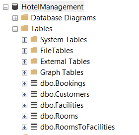
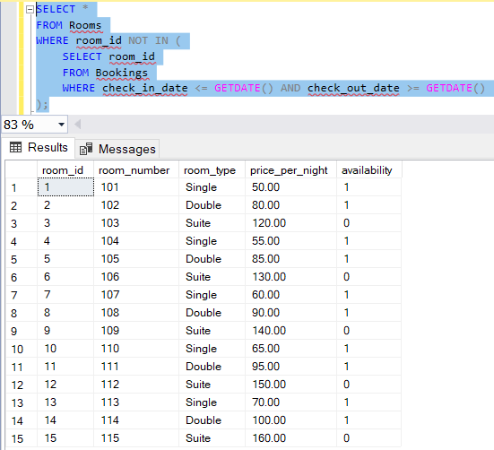
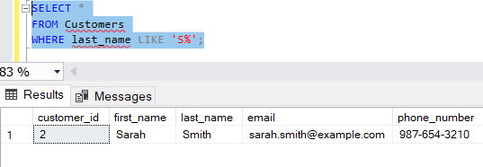
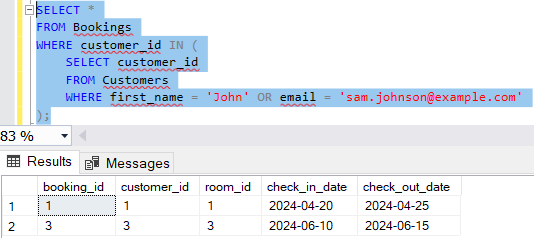
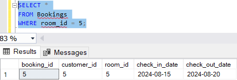
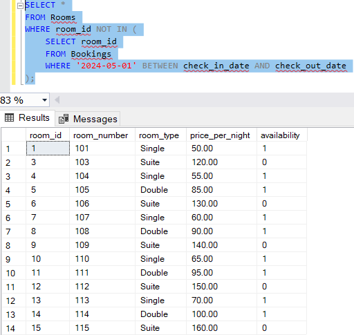
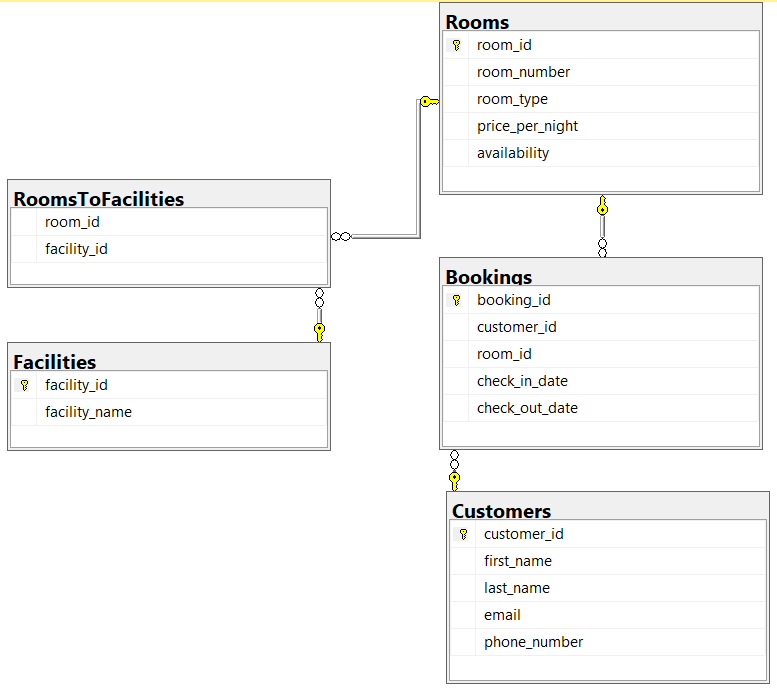

***Часть 1:***
Создание таблицы:
CREATE TABLE Rooms (

`    `room\_id INT PRIMARY KEY NOT NULL,

`    `room\_number VARCHAR(10) NOT NULL,

`    `room\_type VARCHAR(50),

`    `price\_per\_night DECIMAL(10, 2),

`    `availability BIT

);

CREATE TABLE Customers (

`    `customer\_id INT PRIMARY KEY NOT NULL,

`    `first\_name VARCHAR(50),

`    `last\_name VARCHAR(50),

`    `email VARCHAR(100),

`    `phone\_number VARCHAR(20)

);

CREATE TABLE Bookings (

`    `booking\_id INT PRIMARY KEY NOT NULL,

`    `customer\_id INT,

`    `room\_id INT,

`    `check\_in\_date DATE,

`    `check\_out\_date DATE,

`    `FOREIGN KEY (customer\_id) REFERENCES Customers(customer\_id),

`    `FOREIGN KEY (room\_id) REFERENCES Rooms(room\_id)

);

CREATE TABLE Facilities (

`    `facility\_id INT PRIMARY KEY NOT NULL,

`    `facility\_name VARCHAR(100)

);

CREATE TABLE RoomsToFacilities (

`    `room\_id INT,

`    `facility\_id INT,

`    `FOREIGN KEY (room\_id) REFERENCES Rooms(room\_id),

`    `FOREIGN KEY (facility\_id) REFERENCES Facilities(facility\_id)

);

***Часть 2:***
Добавление информации в созданные таблицы:
INSERT INTO Customers (customer\_id, first\_name, last\_name, email, phone\_number)

VALUES

`    `(1, 'John', 'Doe', 'john.doe@example.com', '123-456-7890'),

`    `(2, 'Sarah', 'Smith', 'sarah.smith@example.com', '987-654-3210'),

`    `(3, 'Sam', 'Johnson', 'sam.johnson@example.com', '555-555-5555'),

`    `(4, 'Sophia', 'Williams', 'sophia.williams@example.com', '111-111-1111'),

`    `(5, 'Steven', 'Brown', 'steven.brown@example.com', '222-222-2222'),

`    `(6, 'Samantha', 'Jones', 'samantha.jones@example.com', '333-333-3333'),

`    `(7, 'Scott', 'Davis', 'scott.davis@example.com', '444-444-4444'),

`    `(8, 'Sara', 'Miller', 'sara.miller@example.com', '555-555-5555'),

`    `(9, 'Simon', 'Wilson', 'simon.wilson@example.com', '666-666-6666'),

`    `(10, 'Sophie', 'Anderson', 'sophie.anderson@example.com', '777-777-7777'),

`    `(11, 'Sean', 'Taylor', 'sean.taylor@example.com', '888-888-8888'),

`    `(12, 'Sharon', 'Martinez', 'sharon.martinez@example.com', '999-999-9999'),

`    `(13, 'Shawn', 'Hernandez', 'shawn.hernandez@example.com', '000-000-0000'),

`    `(14, 'Stephanie', 'Garcia', 'stephanie.garcia@example.com', '123-123-1234'),

`    `(15, 'Stella', 'Lopez', 'stella.lopez@example.com', '234-234-2345'); 

INSERT INTO Rooms (room\_id, room\_number, room\_type, price\_per\_night, availability)

VALUES

`    `(1, '101', 'Single', 50.00, 1),

`    `(2, '102', 'Double', 80.00, 1),

`    `(3, '103', 'Suite', 120.00, 0),

`	`(4, '104', 'Single', 55.00, 1),

`    `(5, '105', 'Double', 85.00, 1),

`    `(6, '106', 'Suite', 130.00, 0),

`    `(7, '107', 'Single', 60.00, 1),

`    `(8, '108', 'Double', 90.00, 1),

`    `(9, '109', 'Suite', 140.00, 0),

`    `(10, '110', 'Single', 65.00, 1),

`    `(11, '111', 'Double', 95.00, 1),

`    `(12, '112', 'Suite', 150.00, 0),

`    `(13, '113', 'Single', 70.00, 1),

`    `(14, '114', 'Double', 100.00, 1),

`    `(15, '115', 'Suite', 160.00, 0);

INSERT INTO Bookings (booking\_id, customer\_id, room\_id, check\_in\_date, check\_out\_date)

VALUES

`    `(1, 1, 1, '2024-04-20', '2024-04-25'),

`    `(2, 2, 2, '2024-05-01', '2024-05-05'),

`    `(3, 3, 3, '2024-06-10', '2024-06-15'),

`	`(4, 4, 4, '2024-07-01', '2024-07-05'),

`    `(5, 5, 5, '2024-08-15', '2024-08-20');

INSERT INTO Facilities (facility\_id, facility\_name)

VALUES

`    `(1, 'Wi-Fi'),

`    `(2, 'Air Conditioning'),

`    `(3, 'Mini Bar'),

`	`(4, 'Swimming Pool'),

`    `(5, 'Gym'),

`    `(6, 'Room Service'),

`    `(7, 'Spa'),

`    `(8, 'Parking');

INSERT INTO RoomsToFacilities (room\_id, facility\_id)

VALUES

`    `(1, 1),

`    `(2, 1),

`    `(2, 2),

`    `(3, 3),

`    `(4, 4),

`    `(5, 5),

`    `(6, 6),

`    `(7, 7),

`    `(8, 8);

***Часть 3:***
Вывод информации по требованиям задания:
1\. Найдите все доступные номера для бронирования сегодня.

2\. Найдите всех клиентов, чьи фамилии начинаются с буквы "S".

3\. Найдите все бронирования для определенного клиента (по имени или электронному адресу). 

4\. Найдите все бронирования для определенного номера.

5\. Найдите все номера, которые не забронированы на определенную дату.

6\. Диаграмма нашей DB.

